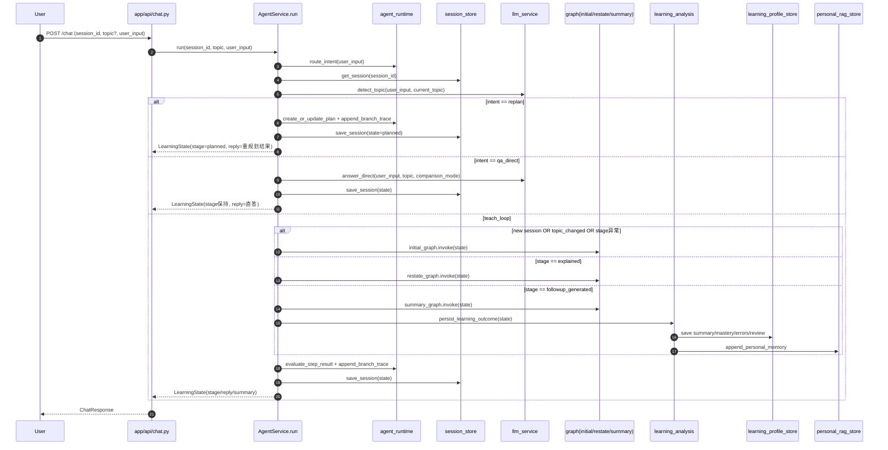
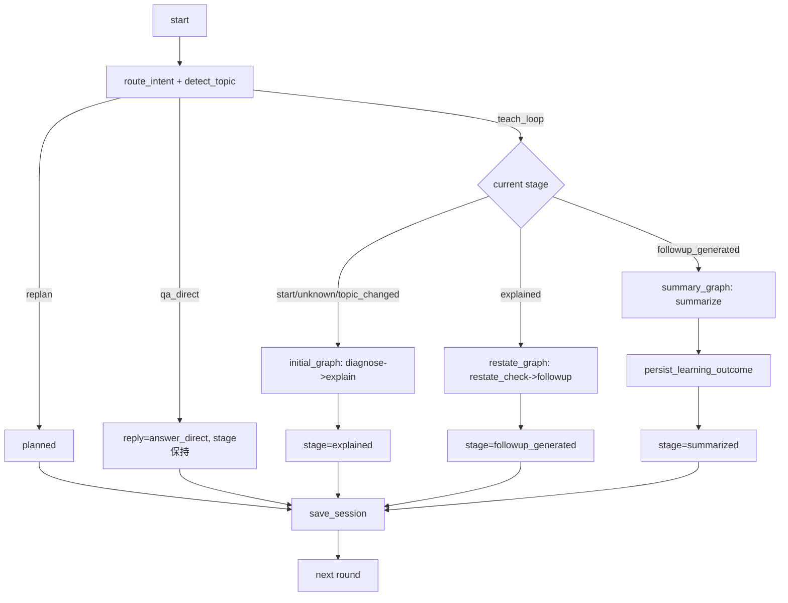
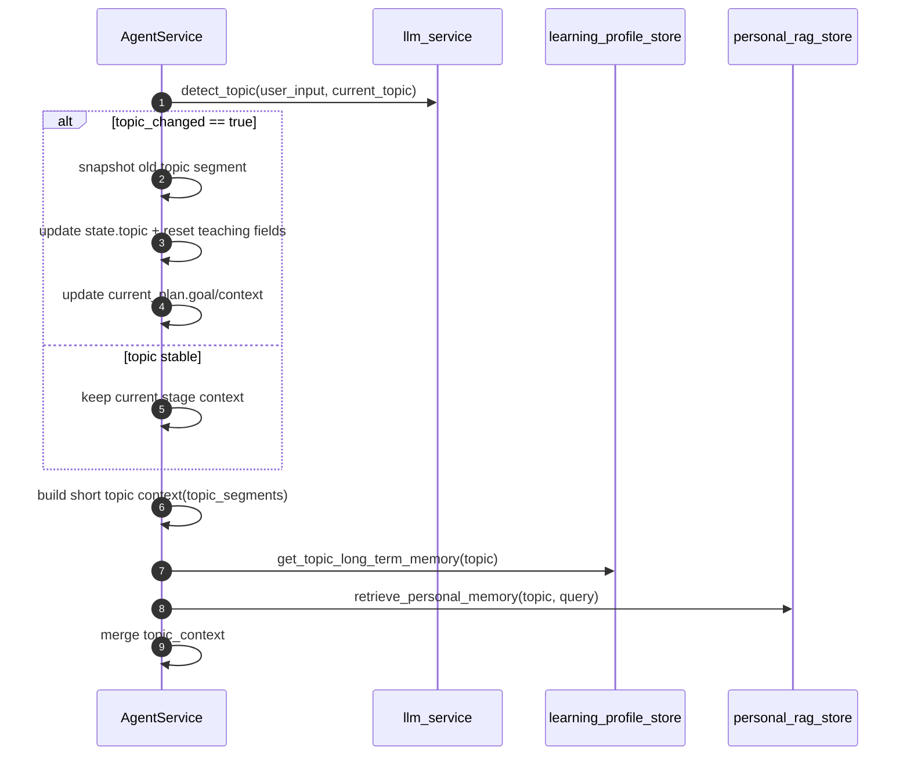
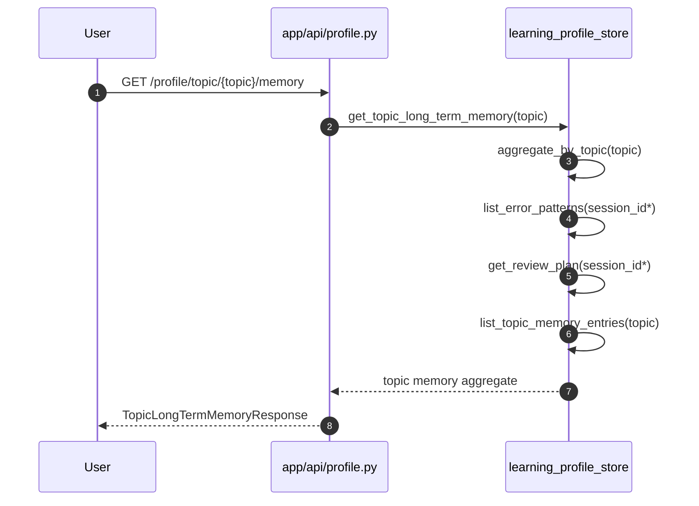
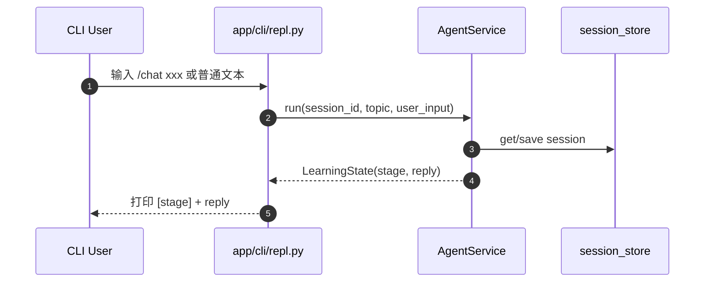
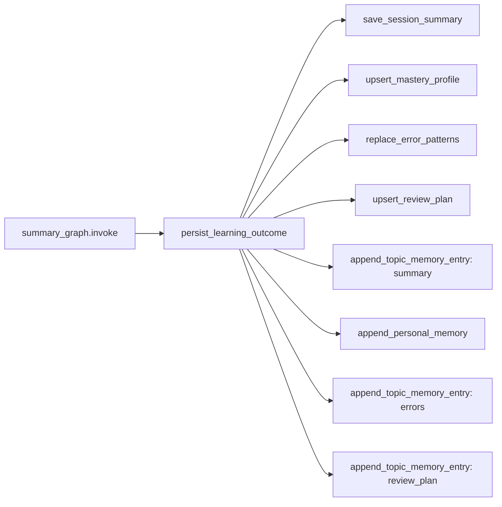
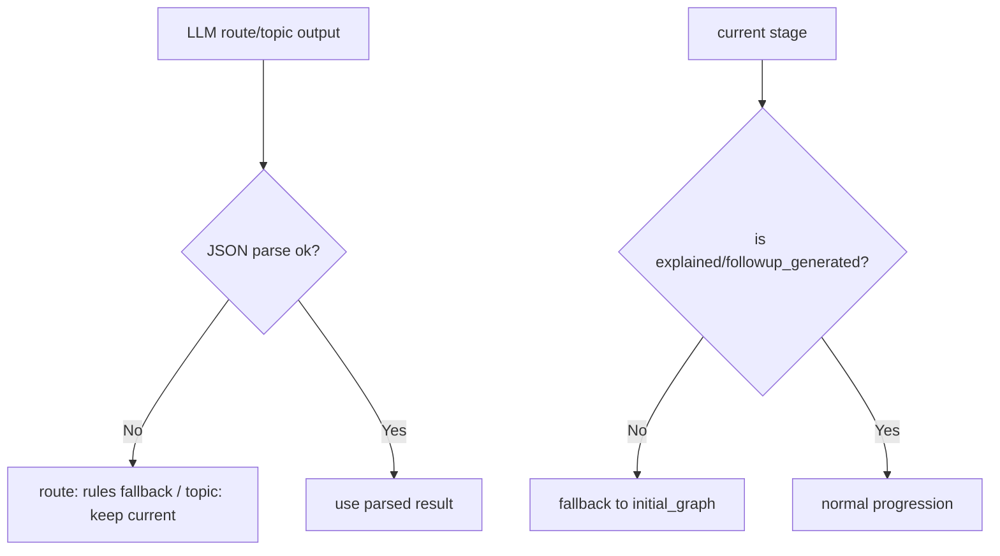

# Learning Agent 项目报告（代码级全量分析）

## 1. 报告范围与结论速览

本报告基于当前仓库代码进行逐模块分析，覆盖 `app/` 全部核心实现、`tests/` 测试体系、配置与存储设计、API/CLI 双入口链路、Agent 执行图与重规划分支逻辑。

结论：该项目是一个以**费曼学习法**为主线的学习辅导 Agent，采用 `FastAPI + LangGraph + LangChain(OpenAI兼容)` 架构，具备：
- 多轮会话教学闭环（诊断→讲解→复述检测→追问→总结）
- 分支路由（teach_loop / qa_direct / replan / review）
- 主题识别与主题切换
- 学习档案沉淀（summary/mastery/errors/review-plan）
- 会话与档案双后端（memory/sqlite）
- CLI 与 HTTP API 共用同一服务层

---

## 2. 项目定位、目标与运行形态

### 2.1 项目定位
- 面向学习场景的 AI 助手，强调“讲明白 + 检验理解 + 追问暴露漏洞 + 复盘巩固”。
- 通过结构化状态和多阶段流程，避免纯问答模式的随机漂移。

### 2.2 核心目标
- 帮用户围绕主题建立可解释的理解链。
- 在多轮对话中保持教学连续性与可追踪性。
- 将每轮结果沉淀为可查询学习档案，支持长期跟踪。

### 2.3 运行形态
- **HTTP API**：`app/main.py` 启动 FastAPI，暴露 `/chat`、`/sessions`、`/skills`、`/profile`。
- **CLI**：根目录 `main.py` 进入 `app/cli/repl.py`，与 API 共用 `agent_service` 和存储层。

---

## 3. 目录与分层架构（按职责）

## 3.1 顶层文件
- `main.py`：CLI 启动入口。
- `README.md`：项目说明、命令、API 简介、环境变量。
- `pyproject.toml`：依赖与开发工具配置。
- `.env.example`：运行所需配置模板。

### 3.2 `app/` 分层
- `app/main.py`：FastAPI 应用装配（路由注册、健康检查）。
- `app/api/`：控制器层，处理请求入参/响应模型转换。
- `app/services/`：业务编排与数据访问核心层。
- `app/agent/`：LangGraph 状态定义与节点执行图。
- `app/models/`：Pydantic 请求/响应 schema。
- `app/core/`：配置加载与提示词模板。
- `app/skills/`：技能抽象、注册中心、内置技能。
- `app/cli/`：命令行交互壳，复用服务层。

### 3.3 `tests/`
- API 功能测试、会话存储测试、CLI 交互测试、分支路由测试、观测脚本。

---

## 4. 技术栈与依赖策略

来自 `pyproject.toml`：
- Web：`fastapi`, `uvicorn`
- Agent/LLM：`langgraph`, `langchain`, `langchain-openai`
- 配置：`pydantic`, `pydantic-settings`, `python-dotenv`
- 测试与规范：`pytest`, `ruff`

实现特点：
- LLM 接口通过 `OPENAI_BASE_URL` 支持 OpenAI 协议兼容服务（例如 Kimi）。
- 通过服务层封装，业务代码几乎不感知底层模型服务差异。

---

## 5. 核心配置层（`app/core`）

## 5.1 `config.py`
`Settings(BaseSettings)` 从 `.env` 读取配置：
- `openai_api_key`, `openai_model`, `openai_base_url`
- `session_store_backend`（memory/sqlite）
- `session_sqlite_path`
- `personal_rag_store_path`

实现思路：
- 用统一 `settings` 单例实现“全局配置注入”。
- 以环境变量控制后端切换，避免代码改动。

### 5.2 `prompts.py`
内含 5 个核心提示词模板：
- `DIAGNOSE_PROMPT`
- `EXPLAIN_PROMPT`
- `RESTATE_CHECK_PROMPT`
- `FOLLOWUP_PROMPT`
- `SUMMARY_PROMPT`

实现细节：
- 每个模板都显式注入 `topic_context`，将短期片段与长期记忆融合到提示中。
- EXPLAIN 模板增加“对比模式约束”，防止跑题。

---

## 6. 状态模型与数据模型

## 6.1 Agent 状态（`app/agent/state.py`）
`LearningState(TypedDict)` 是全系统主状态容器，关键字段分组如下：

- 会话基本信息：`session_id`, `topic`, `user_input`, `stage`, `history`, `reply`
- 教学阶段产物：`diagnosis`, `explanation`, `restatement_eval`, `followup_question`, `summary`
- 评估结果：`mastery_score`, `mastery_level`, `mastery_rationale`, `error_labels`, `next_review_at`
- 路由与规划：`intent`, `intent_confidence`, `current_plan`, `current_step_index`, `need_replan`, `replan_reason`, `next_stage`
- 分支可观测：`branch_trace`
- 主题管理：`topic_confidence`, `topic_changed`, `topic_reason`, `comparison_mode`, `topic_segments`, `topic_context`

`TopicSegment` 用于记录历史主题片段快照，支撑跨主题对话追踪。

### 6.2 API Schema（`app/models/schemas.py`）
主要类型：
- chat：`ChatRequest`, `ChatResponse`
- session：`SessionStateResponse`, `SessionListResponse`, `SessionClearResponse`
- skills：`SkillResponse`, `SkillListResponse`
- profile：`SessionSummaryResponse`, `MasteryProfileResponse`, `ErrorPatternListResponse`, `ReviewPlanResponse`, `LearningProfileResponse`
- tail 查询：`TopicAggregateResponse`, `SessionTimelineResponse`, `ProfileOverviewResponse`, `TopicLongTermMemoryResponse`

实现思路：
- API 层完全用 Pydantic 对外契约化，避免内部状态直接泄露。

---

## 7. Agent 图执行层（`app/agent/graph.py`）

## 7.1 节点职责
- `diagnose_node`：诊断先验水平，产出 `diagnosis`，`stage=diagnosed`
- `explain_node`：费曼讲解，产出 `explanation/reply`，`stage=explained`
- `restate_check_node`：复述评估，产出 `restatement_eval`，`stage=restatement_checked`
- `followup_node`：漏洞追问，产出 `followup_question/reply`，`stage=followup_generated`
- `summarize_node`：总结复盘，产出 `summary`，`stage=summarized`

### 7.2 图构建
- 全流程图：`build_learning_graph()`（A→B→C全链路）
- 阶段图：
  - `initial_graph`：诊断+讲解
  - `restate_graph`：复述检测+追问
  - `summary_graph`：总结

实现思路：
- 将完整流程拆成可复用阶段图，便于多轮会话按阶段推进。

---

## 8. LLM 服务层（`app/services/llm.py`）

`LLMService` 提供：
- `_get_llm()`：懒加载 `ChatOpenAI`，未配置 key 时抛异常
- `invoke(system_prompt, user_prompt)`：统一调用入口
- `route_intent(user_input)`：输出 JSON 路由意图
- `detect_topic(user_input, current_topic)`：识别主题、是否切换、对比模式
- `answer_direct(...)`：直接问答分支答案生成

实现细节：
- 所有分支都经由统一 LLM 包装，业务层不处理模型 SDK 细节。
- route/topic 要求严格 JSON 输出，业务层再做兜底解析。

---

## 9. 运行时路由与计划器（`app/services/agent_runtime.py`）

核心能力：
- `route_intent()`：先 LLM 路由，再规则回退
- `_route_intent_with_rules()`：关键词规则（replan/review/qa_direct/teach_loop）
- `create_or_update_plan()`：生成三步计划结构（诊断讲解→检测追问→总结）
- `evaluate_step_result()`：根据 stage 判断成功、完成、是否需重规划
- `append_branch_trace()`：持续记录分支轨迹

设计价值：
- LLM 不稳定时仍可工作（规则回退）。
- 对话流程可解释（branch_trace 可追溯每次决策）。

---

## 10. 核心编排服务（`app/services/agent_service.py`）

这是项目最关键的业务中枢，`run(session_id, topic, user_input)` 的端到端逻辑如下：

### 10.1 预处理阶段
1. 路由识别：`route_intent(user_input)`
2. 读取会话：`get_session(session_id)`
3. 主题识别：`_detect_topic(user_input, current_topic)`（含 fenced-json 解析）
4. 构造上下文：
   - `_build_topic_context()`：短期主题片段摘要（最多3段）
   - `_build_long_term_context()`：长期记忆（卡点、常见错因、掌握趋势、personal_rag 命中）

### 10.2 新会话分支
- 初始化 `LearningState`（含 plan、trace、topic flags）
- 若路由是 `replan`：执行 `_apply_replan()` 直接返回 `stage=planned`
- 否则执行 `initial_graph`，再执行 `evaluate_step_result`、写入 history 并持久化

### 10.3 已有会话分支
- 更新输入与 history
- 检测是否主题切换：若切换，先快照旧主题到 `topic_segments`
- 路由分支：
  - `replan`：重建计划并返回 planned
  - `qa_direct`：调用 `answer_direct`，stage 保持不变
  - `teach_loop`：
    - 若主题切换：重置教学字段并从 `initial_graph` 重新讲解
    - 否则按 stage 推进：
      - explained → `restate_graph`
      - followup_generated → `summary_graph` + `persist_learning_outcome()`
      - 其他异常 stage → fallback 到 `initial_graph`

### 10.4 产物沉淀与状态收敛
- critic 评估：`need_replan/replan_reason/current_step_index`
- branch trace 持续追加（topic/router/executor/critic/planner）
- `save_session` 持久化最终状态

实现亮点：
- 多分支并发复杂度通过 `stage + intent + topic_changed` 三元控制。
- 异常 stage 具备回退修复能力，避免会话“卡死”。

---

## 11. 存储层设计（会话、档案、长期记忆）

## 11.1 会话存储抽象（`session_store.py`）
- 内存：`SESSION_STORE: Dict[str, LearningState]`
- sqlite：委托 `session_store_sqlite.py`
- 统一 API：`get/save/clear/list/clear_all`

### 11.2 会话 sqlite（`session_store_sqlite.py`）
表：`sessions(session_id PRIMARY KEY, payload TEXT)`
- 状态整体 JSON 序列化存储。
- `INSERT ... ON CONFLICT DO UPDATE` 实现 upsert。

优点：开发快、结构灵活。  
代价：难做字段级查询与统计。

### 11.3 学习档案存储（`learning_profile_store.py`）
内存容器：
- `_MEMORY_SESSION_SUMMARIES`
- `_MEMORY_MASTERY_PROFILES`
- `_MEMORY_ERROR_PATTERNS`
- `_MEMORY_REVIEW_PLANS`
- `_MEMORY_TOPIC_MEMORY_ENTRIES`

sqlite 表：
- `session_summaries`
- `mastery_profiles`
- `error_patterns`
- `review_plans`
- `topic_memory_entries`

核心能力函数：
- 单会话档案读写：summary/mastery/errors/review
- 聚合查询：`aggregate_by_topic`, `build_session_timeline`, `get_profile_overview`, `get_topic_long_term_memory`
- session id 汇总：memory/sqlite 双实现

### 11.4 学习结果分析沉淀（`learning_analysis.py`）
`persist_learning_outcome(state)` 在总结阶段执行：
1. 保存总结
2. 规则计算掌握度分数（关键词加减分）
3. 归纳错因标签
4. 生成复习计划（按分数设复习时间与建议）
5. 追加 topic memory entries
6. 写入 personal rag memory

注意：当前评估规则是启发式关键词匹配，易受文本风格影响。

### 11.5 Personal RAG（`personal_rag_store.py`）
- 追加写入：内存列表 + JSONL 落盘
- 检索：query/content 分词后做 token 交集打分，按相关度+时间排序并去重

特征：
- 轻量、无 embedding 依赖、可本地快速运行
- 语义召回能力有限，偏关键词匹配

---

## 12. API 层详细分析（`app/api`）

## 12.1 `/chat`（`chat.py`）
- 入参：`ChatRequest(session_id, user_input, topic?)`
- 出参：`ChatResponse(session_id, stage, reply, summary?)`
- 逻辑：直接委托 `agent_service.run()`

### 12.2 `/sessions`（`sessions.py`）
- `GET /sessions`：列会话摘要
- `GET /sessions/{session_id}`：会话详情（含 history/topic_segments）
- `DELETE /sessions/{session_id}`：删单会话
- `DELETE /sessions`：清空全部

### 12.3 `/skills`（`skills.py`）
- `GET /skills`：列出技能
- `GET /skills/{name}`：技能详情，不存在返回 404

### 12.4 `/profile`（`profile.py`）
- 单会话维度：
  - `/{sid}`
  - `/{sid}/summary`
  - `/{sid}/mastery`
  - `/{sid}/errors`
  - `/{sid}/review-plan`
- 聚合维度：
  - `/overview`
  - `/topic/{topic}`
  - `/topic/{topic}/memory`
  - `/session/{sid}/timeline`

实现特点：
- 接口层仅做 DTO 拼装与 404 判定，业务计算都在 store/service 层。

---

## 13. 技能系统（`app/skills`）

## 13.1 抽象定义
- `BaseSkill`：要求 `name/description/run(**kwargs)`

### 13.2 注册中心
- `SkillRegistry`：`register/get/list`
- 重复注册与空名称均抛 `ValueError`

### 13.3 内置技能
- `ExplainTermSkill`
- `GenerateQuizSkill`
- `register_builtin_skills()`：幂等注册

当前状态：
- 技能系统已具备扩展骨架，但尚未深度接入 agent 主流程（更多用于查询与展示）。

---

## 14. CLI 架构与实现（`app/cli/repl.py`）

### 14.1 上下文
- `CLIContext(session_id, topic, running)`

### 14.2 命令路由机制
- `commands: dict[str, handler]`，支持 `/help /session /topic /chat /profile /plan /trace /skills /status /exit`
- `shlex.split` 解析命令参数

### 14.3 关键链路
- 普通文本输入 → `_send_chat` → `agent_service.run`
- `/profile`、`/sessions` 相关命令直接调用同一服务层查询函数

### 14.4 设计价值
- CLI 与 API 严格共享服务层，行为一致，便于调试与演示。

---

## 15. 启动入口与应用装配

### 15.1 API 入口（`app/main.py`）
- 创建 `FastAPI(title=settings.app_name, debug=settings.debug)`
- 启动时注册内置技能
- 挂载 `chat/sessions/skills/profile` 路由
- `GET /health`

### 15.2 CLI 入口（根 `main.py`）
- 仅代理到 `app.cli.repl.main()`

---

## 16. 关键流程（端到端）

## 16.1 Chat 请求链路
`POST /chat` → `api.chat.chat()` → `agent_service.run()` →  
intent/topic 识别 + 上下文构建 + 图执行/分支执行 →  
（可能）`persist_learning_outcome()` → `save_session()` → `ChatResponse`

### 16.2 Session 管理链路
`/sessions` API 调用 `session_store` 抽象层，按配置自动路由 memory/sqlite。

### 16.3 Profile 查询链路
`/profile*` API → `learning_profile_store` 聚合计算 → schema 化输出。

### 16.4 Skills 查询链路
`/skills` API → `skill_registry`。

### 16.5 CLI 链路
输入命令或文本 → 命令分发/聊天发送 → 与 API 同构业务流程。

---

## 17. 测试体系与覆盖分析（`tests/`）

### 17.1 已有测试映射
- `test_health.py`：健康检查
- `test_chat_flow.py`：三阶段流转、主题切换、fenced json 解析、topic_context 注入、长期记忆注入
- `test_agent_replan_branch.py`：qa_direct/replan/首轮replan/路由回退
- `test_sessions_api.py`：会话列表/详情/删除
- `test_skills_api.py`：技能列表、详情、404
- `test_learning_profile_api.py`：档案接口完整性
- `test_profile_tail_api.py`：overview/topic/timeline/topic-memory 收尾接口
- `test_session_store_sqlite.py`：sqlite 会话存储读写清理
- `test_cli_repl.py`：CLI 命令和聊天输出
- `route_trace_observer.py`：路由阶段观测脚本（支持 mock/真实模型）

### 17.2 覆盖特点
- 业务关键链路（chat stages + replan + topic shift）覆盖较好。
- API 层基本全覆盖。

### 17.3 缺口与风险
- 对 `learning_profile_store` sqlite 分支缺少更细粒度单测（多表一致性、边界数据）。
- 对 `personal_rag_store` 检索排序/去重策略缺少专项测试。
- 对异常路径（LLM超时、JSON污染、sqlite锁竞争）覆盖偏弱。

---

## 18. 架构优势、耦合点与改进建议

## 18.1 优势
- 分层清晰：API/Service/Agent/Store 边界明确。
- 可解释性强：`branch_trace` + `topic_segments` 便于观测。
- 扩展友好：分支路由、计划器、技能注册中心都可独立演进。
- 双入口一致：CLI 与 API 复用业务内核。

### 18.2 当前耦合点
- `agent_service` 体量大，承担路由、主题管理、上下文拼接、阶段推进、持久化等多职责。
- `session_store_backend` 同时控制会话存储与 profile 存储，策略粒度偏粗。
- sqlite payload JSON 存储对分析查询不友好。

### 18.3 风险点
- `route_intent/topic_detect` 对 LLM JSON 输出依赖高，虽然有回退，但仍可能出现语义误路由。
- 规则型 mastery/error 提取可解释但精度有限。
- CLI `_send_chat` 捕获广义异常，便于交互但会弱化错误分类。

### 18.4 建议方向
- 拆分 `agent_service`：topic manager / context builder / stage orchestrator / persistence coordinator。
- 引入更结构化的结果评估（模板化评分或模型评分+规则校验）。
- 为 profile/sqlite 与 personal_rag 增加专项单测与并发测试。
- 后续升级到 PostgreSQL 时，将 topic memory 与 profile 聚合改为可索引实体表。

---

## 19. 章节化提交建议（可直接复用）

建议提交时使用以下结构：
1. 项目定位与目标  
2. 分层架构总览  
3. 核心状态与数据模型  
4. Agent 多阶段工作流  
5. 路由与重规划机制  
6. 会话/档案/长期记忆存储设计  
7. API 详细说明（chat/sessions/skills/profile）  
8. CLI 交互架构  
9. 测试覆盖与质量评估  
10. 架构优缺点与演进路线

---

## 20. 后续可提问方向（便于继续深挖）

- 想看 `agent_service.run` 的逐行执行时序图（含每个分支条件）。
- 想把 `learning_profile_store` 的 memory/sqlite 数据结构对齐成统一仓储接口。
- 想设计 v0.3 的 RAG（embedding + 向量检索）替换当前 token overlap。
- 想补全测试矩阵（异常路径、并发、回归基线）。

---

## 21. 逐文件函数级调用关系图（新增）

本章节按“文件 -> 关键类/函数 -> 调用关系 -> 输入输出 -> 分支/异常”组织，便于你后续答辩时逐文件讲解。

### 21.1 顶层入口

#### `main.py`（根目录）
- `main()` -> `app.cli.repl.main()`
- 作用：仅作为 CLI 启动代理。
- 输入输出：无参数；启动交互循环直到退出。

#### `app/main.py`
- 模块加载时创建 `FastAPI` 实例并注册路由。
- `health()` -> 返回 `{"status":"ok","app":settings.app_name}`。
- 调用关系：
  - `register_builtin_skills()`
  - `include_router(chat/sessions/skills/profile)`

### 21.2 API 控制层

#### `app/api/chat.py`
- `chat(request: ChatRequest) -> ChatResponse`
- 调用链：`agent_service.run(...)` -> 从 `LearningState` 抽取 `session_id/stage/reply/summary`。
- 分支：无本地分支，完全委托 service。

#### `app/api/sessions.py`
- `get_sessions()` -> `list_sessions()` -> 逐项映射 `SessionStateResponse`
- `get_session_detail(session_id)` -> `get_session()`；空则 `HTTPException(404)`
- `delete_session(session_id)` -> 存在性检查后 `clear_session()`
- `delete_all_sessions()` -> `clear_all_sessions()`

#### `app/api/skills.py`
- `list_skills()` -> `skill_registry.list()`
- `get_skill(skill_name)` -> `skill_registry.get()`；空则 404

#### `app/api/profile.py`
- `get_summary/get_mastery/get_errors/get_plan`：单能力查询，空则 404
- `get_profile(session_id)`：聚合查询 `get_learning_profile()`；全空则 404
- `get_overview()`：`get_profile_overview()`
- `get_topic_aggregate(topic)`：`aggregate_by_topic(topic)`
- `get_topic_memory(topic)`：`get_topic_long_term_memory(topic)`
- `get_session_timeline(session_id)`：`build_session_timeline(session_id)`；空则 404

### 21.3 Agent 状态与图

#### `app/agent/state.py`
- `TopicSegment(TypedDict)`：单主题片段快照结构。
- `LearningState(TypedDict)`：主状态对象（路由/计划/教学/记忆/追踪字段全集）。

#### `app/agent/graph.py`
- `diagnose_node(state)`：组装 `DIAGNOSE_PROMPT` -> `llm_service.invoke` -> 写 `diagnosis/stage`
- `explain_node(state)`：组装 `EXPLAIN_PROMPT` -> 写 `explanation/reply/stage`
- `restate_check_node(state)`：组装 `RESTATE_CHECK_PROMPT` -> 写 `restatement_eval/stage`
- `followup_node(state)`：组装 `FOLLOWUP_PROMPT` -> 写 `followup_question/reply/stage`
- `summarize_node(state)`：组装 `SUMMARY_PROMPT` -> 写 `summary/stage`
- 图构建函数：
  - `build_learning_graph()`：完整链路
  - `build_initial_graph()`：A 阶段
  - `build_restate_graph()`：B 阶段
  - `build_summary_graph()`：C 阶段

### 21.4 业务编排核心（重点）

#### `app/services/agent_service.py` -> `class AgentService`

核心私有函数：
- `_parse_json_text(raw)`：兼容 ```json fenced block 的 JSON 解析。
- `_detect_topic(user_input, current_topic)`：调用 `llm_service.detect_topic`，解析出 `topic/changed/confidence/reason/comparison_mode`；异常回退到当前主题。
- `_apply_replan(state)`：重建 `current_plan`，设置 `stage=planned`，写 `next_stage=start`，追加 `branch_trace(planner)`。
- `_snapshot_topic_segment(state)`：提取当前主题教学快照。
- `_build_topic_context(state, max_segments=3)`：从同主题历史片段提炼摘要上下文。
- `_build_long_term_context(topic, user_input)`：
  - `get_topic_long_term_memory(topic)`
  - `retrieve_personal_memory(topic, query, limit=2)`
  - 合成“上次卡点/常见错误/最近掌握度/个人记忆命中”文本

核心公有函数：
- `run(session_id, topic, user_input) -> LearningState`

调用关系总图（简化）：
1. `route_intent(user_input)`（agent_runtime）
2. `get_session(session_id)`（session_store）
3. `_detect_topic(...)`
4. 根据是否新会话 + intent + topic_changed 进入分支：
   - `replan`：`_apply_replan` -> `save_session`
   - `qa_direct`：`llm_service.answer_direct` -> `save_session`
   - teach_loop:
     - 新会话/主题切换/异常状态 -> `initial_graph.invoke`
     - explained -> `restate_graph.invoke`
     - followup_generated -> `summary_graph.invoke` -> `persist_learning_outcome`
5. `evaluate_step_result(result)`（agent_runtime）
6. `append_branch_trace(result, {"phase":"critic",...})`
7. 写 `history` 与 `save_session(session_id, result)`

关键输入输出：
- 输入：`session_id/topic/user_input`
- 输出：完整 `LearningState`（API/CLI 只消费其中少数字段）

关键状态转移：
- `start -> explained -> followup_generated -> summarized`
- 任意阶段可被 `replan` 打断到 `planned`
- `qa_direct` 不推进 stage，仅回复直答结果

异常/回退：
- topic 检测异常：保持 current topic
- 路由 JSON 非法：走规则路由
- stage 非法：fallback 到 `initial_graph`

### 21.5 路由与规划器

#### `app/services/agent_runtime.py`
- `RouterResult(intent, confidence, reason)`：路由结果对象
- `route_intent(user_input)`：
  - 先 `_route_intent_with_llm`
  - 再 `_route_intent_with_rules`（关键词）
- `_route_intent_with_llm`：解析 JSON；intent 非白名单则回退
- `_route_intent_with_rules`：关键词触发 `replan/review/qa_direct`，默认 `teach_loop`
- `create_or_update_plan(state)`：输出 `goal/context/steps/exit_criteria/fallback_strategy`
- `evaluate_step_result(state)`：按 stage 推断 success/done/need_replan
- `append_branch_trace(state, event)`：追加事件

### 21.6 LLM 适配层

#### `app/services/llm.py`
- `LLMService._get_llm()`：
  - 校验 `OPENAI_API_KEY`
  - 初始化 `ChatOpenAI(api_key, model, base_url, temperature=0.3)`
- `invoke(system_prompt, user_prompt)`：统一 message 组装与返回文本
- `route_intent(user_input)`：输出路由 JSON
- `detect_topic(user_input, current_topic)`：输出主题 JSON
- `answer_direct(user_input, topic, comparison_mode)`：直答分支

失败路径：
- 未配置 key 直接抛 `ValueError`，由上层（如 CLI）捕获并提示。

### 21.7 会话存储层

#### `app/services/session_store.py`
- `_use_sqlite()`：由 `settings.session_store_backend` 控制
- `get/save/clear/list/clear_all`：memory 与 sqlite 双分支转发

#### `app/services/session_store_sqlite.py`
- `SQLiteSessionStore`：
  - `_init_table()`：初始化 `sessions` 表
  - `get_session`：查 payload JSON -> dict
  - `save_session`：upsert payload
  - `list_sessions`：全量读出字典
  - `clear_session/clear_all_sessions`
- `get_sqlite_session_store()`：按路径缓存 store 实例

### 21.8 学习档案与聚合层

#### `app/services/learning_analysis.py`
- `_calc_mastery_score(state)`：规则计算 score/level/rationale
- `_extract_error_labels(state)`：规则提取错因标签
- `_build_review_plan(score)`：生成 `next_review_at + suggestions`
- `persist_learning_outcome(state)`：
  - 调 `learning_profile_store` 写 summary/mastery/errors/review
  - 调 `append_topic_memory_entry` 与 `append_personal_memory`
  - 回写 `state` 中 mastery/error/review 字段

#### `app/services/learning_profile_store.py`

类与工厂：
- `LearningProfileSQLiteStore`
- `_get_sqlite_store()`

写入函数：
- `save_session_summary`
- `upsert_mastery_profile`
- `replace_error_patterns`
- `upsert_review_plan`
- `append_topic_memory_entry`

读取函数：
- `get_session_summary/get_mastery_profile/list_error_patterns/get_review_plan`
- `list_topic_memory_entries`
- `get_learning_profile`

聚合函数：
- `list_session_ids`（memory/sqlite 汇总）
- `aggregate_by_topic`
- `build_session_timeline`
- `get_profile_overview`
- `get_topic_long_term_memory`

调用关系重点：
- API `/profile*` 直接调用上述读取/聚合函数。
- `persist_learning_outcome` 调用写入函数。
- `agent_service._build_long_term_context` 调用 `get_topic_long_term_memory`。

### 21.9 Personal RAG 轻量记忆层

#### `app/services/personal_rag_store.py`
- `_store_path()`：持久化路径
- `_tokenize(text)`：中文/英文/数字分词清洗
- `append_personal_memory(...)`：内存追加 + JSONL 追加写
- `_iter_disk_items()`：读取磁盘 JSONL
- `retrieve_personal_memory(topic, query, limit)`：
  - query/content token 交集计分
  - 按 `(score, created_at)` 倒序
  - 去重后截断

### 21.10 技能层

#### `app/skills/base.py`
- `BaseSkill.run(**kwargs)` 抽象方法，定义扩展契约。

#### `app/skills/registry.py`
- `SkillRegistry.register/get/list`
- 校验重复名称与空名称。

#### `app/skills/builtin.py`
- `ExplainTermSkill.run`
- `GenerateQuizSkill.run`
- `register_builtin_skills()`：幂等注册，防重复。

### 21.11 CLI 层函数级关系

#### `app/cli/repl.py` -> `class LearningAgentCLI`

初始化：
- `__init__` 建立 `CLIContext` 与命令映射表。

主循环：
- `run()` -> `input()` -> `_dispatch_command()` 或 `_send_chat()`

命令分发：
- `_dispatch_command(raw_command)` -> `shlex.split` -> handler

核心命令函数：
- `_cmd_help/_cmd_exit/_cmd_status`
- `_cmd_session`：new/set/list/clear/clear-all
- `_cmd_topic`：show/set/clear
- `_cmd_skills`：列表或详情
- `_cmd_profile`：overview/topic/timeline/session-profile
- `_cmd_chat`
- `_cmd_plan`：显示 `current_plan`
- `_cmd_trace`：显示 `branch_trace/topic_segments`

聊天发送：
- `_send_chat(user_input)` -> `agent_service.run(...)`
- 输出 `stage` 与 `reply`
- 异常路径：捕获异常并打印“调用失败: err”

### 21.12 配置与模型文件

#### `app/core/config.py`
- `Settings` 字段即系统行为开关；所有 service 间接依赖该单例。

#### `app/models/schemas.py`
- 全部为 DTO 模型；不承载业务逻辑，但决定 API 契约稳定性。

### 21.13 按调用链视角的“总图”

1. **入口层**  
HTTP: `app.main` -> API handler  
CLI: `main.py` -> `cli.repl`

2. **编排层**  
API/CLI -> `agent_service.run`

3. **决策层**  
`agent_runtime.route_intent` + `_detect_topic`

4. **执行层**  
`initial_graph/restate_graph/summary_graph` 节点调用 `llm_service.invoke`

5. **沉淀层**  
`persist_learning_outcome` -> `learning_profile_store` + `personal_rag_store`

6. **状态层**  
`session_store` 保存 `LearningState`，供下一轮继续流转

---

## 22. 可直接用于答辩的“模块讲解顺序”

建议按以下顺序讲（从主线到细节）：
1. `app/services/agent_service.py`（主编排）
2. `app/agent/graph.py` + `app/agent/state.py`（阶段与状态）
3. `app/services/agent_runtime.py`（路由与计划）
4. `app/services/learning_analysis.py` + `learning_profile_store.py`（学习档案）
5. `app/services/session_store*.py`（会话持久化）
6. `app/services/llm.py`（模型适配）
7. `app/api/*.py`（对外接口）
8. `app/cli/repl.py`（交互入口）
9. `tests/*.py`（质量保障）

---

## 23. Mermaid 调用时序图与分支流转图（新增）

> 说明：以下图可直接用于你后续汇报 PPT 或答辩文档。

### 23.1 HTTP Chat 端到端时序图




### 23.2 Agent 内部阶段流转图（含分支）



### 23.3 Topic 切换与上下文构建时序图



### 23.4 Profile 聚合查询时序图



### 23.5 CLI 调用链时序图



### 23.6 存储写入图（总结阶段）



### 23.7 异常与回退逻辑图



