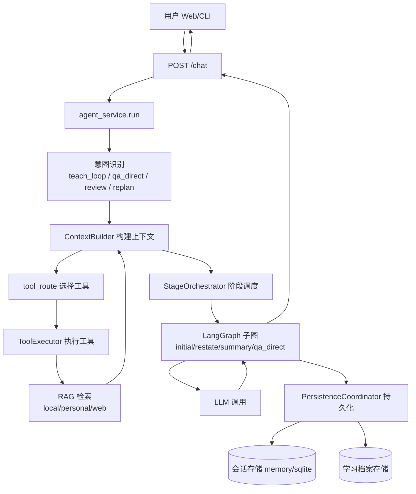
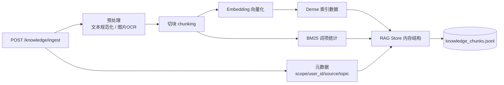
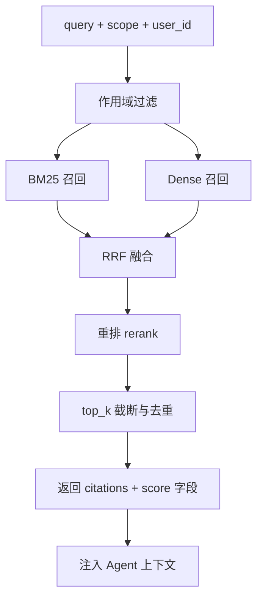

# StudyAgent 项目框架结构与数据流转总结

## 1. 项目全景（基于 `plan/` + `worklog/` + 核心代码）

本项目是一个面向学习场景的 Agent 系统，核心目标是把“用户提问/学习”转成可追踪的学习闭环：**输入问题 → 诊断与讲解 → 复述评估 → 追问补救 → 总结沉淀**。  
整体由 FastAPI + LangGraph + RAG + 工具路由 + 会话/档案存储构成，且已经从早期“单体编排”演进到“协调器拆分”。

核心模块分层：

- **接口层**：`app/main.py`、`app/api/*.py`（chat、knowledge、sessions、profile、skills、auth）
- **编排层**：`app/services/agent_service.py` + `app/agent/graph.py`
- **协调器层**：`app/services/orchestration/{context_builder,stage_orchestrator,persistence_coordinator}.py`
- **能力层**：`app/services/{rag_service,retriever,tool_executor,llm,evaluation_service}.py`
- **存储层**：`session_store`（memory/sqlite）、`rag_store`（jsonl + 内存索引）、learning profile 存储
- **交互层**：CLI（`app/cli/repl.py`）与 Chainlit（`app/ui/*.py`）

## 2. 端到端主数据流（用户交互链路）

说明：

- Chat 请求在 `app/api/chat.py` 进入，统一交给 `agent_service`。
- 编排阶段会先构建 RAG 上下文，再进入 LangGraph 阶段流转。
- 输出不只返回回答，还会回写会话状态、学习评估和复盘数据。

## 3. RAG 建库数据流（入库链路）

说明：

- 入口在 `app/api/knowledge.py`，服务在 `app/services/rag_service.py`。
- 核心存储与检索算法在 `app/services/rag_store.py`。
- 支持 `global` 与 `personal` 两类作用域，`personal` 依赖 `user_id` 做隔离。

## 4. RAG 检索数据流（查询链路）

说明：

- 混合检索策略：**BM25 + Dense + RRF + Rerank**。
- 检索适配抽象在 `app/services/retriever.py`，工具执行在 `app/services/tool_executor.py`。
- 证据带 `scope/user_id/tool` 等字段，支持可追溯。

## 5. 关键数据对象流转

1. **用户与身份**
- `user_id` 在 chat / session / profile / personal rag 全链路传递（见 `worklog/012...`）。

2. **会话态**
- 请求态 + 阶段态进入 `LearningState`（`app/agent/state.py`），阶段推进后写入 `session_store`。

3. **学习档案**
- 由 `evaluation_service` 产出结构化评估（mastery、error_labels、rationale），再由 persistence/analysis 模块入库。

4. **知识数据**
- 文档经 ingest 进入 chunk 集合，检索时按 scope/user_id 过滤并打分，返回 citations 给 LLM 参考。

## 6. 架构演进脉络（来自 `worklog/` 与 `plan/`）

### 阶段A：RAG基础能力搭建
- 图文统一入库、切块、embedding、混合检索、重排方案落地（`worklog/002~005,011`）。

### 阶段B：Agent编排重构
- 从“单体式 agent 逻辑”拆为上下文构建/阶段调度/持久化协调（`worklog/008,013`）。
- 评估从启发式走向 LLM 结构化评估（`worklog/009`）。

### 阶段C：多用户与双轨隔离
- 用户登录注册与 `user_id` 全链路接入（`worklog/012`）。
- global-personal 双轨知识隔离完成（`worklog/010`）。

### 阶段D：工具化与路由演进
- tool route、retriever 抽象、search-web provider 可插拔（`worklog/014~018`）。
- Chainlit MVP 与交互增强（`worklog/019,020`）。
- 管理员知识库 CRUD 与全流程观测脚本（`worklog/021~023`）。

## 7. 当前实现与设计文档一致性

与 `plan/架构演进.md`、`plan/架构修改建议.md` 对照：

- **已基本完成**：编排解耦、RAG 双轨隔离、评估升级、工具路由预埋、会话/学习档案 API。
- **仍在演进**：更强的工具原生化（如更深 ToolNode/MCP 化）、更高规模向量底座、统一可观测与线上治理。

## 8. 关键文件索引（建议优先阅读）

- 入口与路由：
  - `app/main.py`
  - `app/api/chat.py`
  - `app/api/knowledge.py`
  - `app/api/sessions.py`
  - `app/api/profile.py`

- 编排与状态：
  - `app/services/agent_service.py`
  - `app/agent/graph.py`
  - `app/agent/state.py`
  - `app/services/orchestration/context_builder.py`
  - `app/services/orchestration/stage_orchestrator.py`
  - `app/services/orchestration/persistence_coordinator.py`

- RAG与工具：
  - `app/services/rag_service.py`
  - `app/services/rag_store.py`
  - `app/services/retriever.py`
  - `app/services/tool_executor.py`
  - `app/skills/builtin.py`
  - `app/skills/registry.py`

- 评估与持久化：
  - `app/services/evaluation_service.py`
  - `app/services/learning_analysis.py`
  - `app/services/session_store.py`
  - `app/services/session_store_sqlite.py`

- 计划与演进文档：
  - `plan/README.md`
  - `plan/架构演进.md`
  - `plan/架构修改建议.md`
  - `plan/RAG实现现状详解.md`
  - `worklog/README.md`
  - `worklog/001-023*.md`

## 9. 总结

这个项目的数据流设计已经形成“**教学编排 + 检索增强 + 工具扩展 + 持久化沉淀**”的闭环，且从日志看演进路径清晰、迭代连续。当前最强价值点是：

- 学习过程可阶段化管理（Agent图）
- 知识检索可解释（citations + 分数链）
- 用户数据可隔离（user_id + personal scope）
- 会话结果可沉淀（profile + session history）

后续重点可放在规模化与可观测：更强向量存储底座、统一监控指标、鉴权和权限收口。
