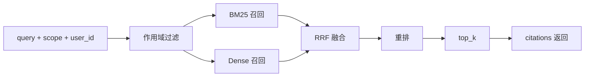
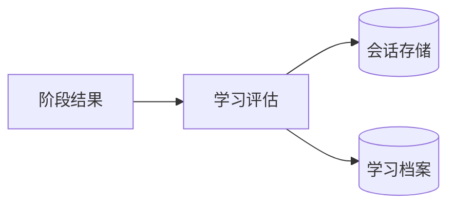

# StudyAgent 精简版数据流图（1页速览）

## 1) 主链路：用户提问到回答

```mermaid
flowchart LR
    U[用户] --> CHAT[/chat API]
    CHAT --> AGENT[Agent 编排]
    AGENT --> TOOL[工具路由与执行]
    TOOL --> RAG[RAG 检索]
    AGENT --> LLM[LLM 推理]
    RAG --> LLM
    LLM --> OUT[回答 + citations]
    OUT --> U
```


## 2) 建库链路：知识入库

```mermaid
flowchart LR
    DOC[文本/图片] --> INGEST[/knowledge/ingest]
    INGEST --> PRE[预处理 + OCR]
    PRE --> CHUNK[切块]
    CHUNK --> EMB[Embedding]
    EMB --> STORE[(RAG Store)]
    STORE --> FILE[(knowledge_chunks.jsonl)]
```


## 3) 检索链路：查询到证据




## 4) 持久化链路：学习沉淀




## 5) 一句话总结

系统形成了“**交互编排（Agent）+ 检索增强（RAG）+ 工具执行（Tool）+ 学习沉淀（Session/Profile）**”的闭环，并通过 `scope + user_id` 实现知识与数据隔离。
